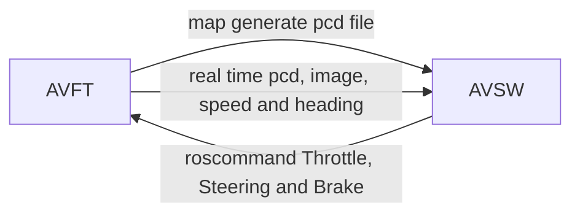

### Autonomous Vehicle Fidelity Testing



```bash
# env
OS:   Ubuntu 18.04 
ROS version:  melodic
Carla Server: 0.9.12
Carla Client: 0.9.12
Map: OpenDriver Format
```

```bash
# msg rostopic input
lidar: /carla/ego_vehicle/lidar
camera: /carla/ego_vehicle/rgb_front/image
odometry: /carla/ego_vehicle/odometry

# msg rostopic output
control: /carla/ego_vehicle/vehicle_control_cmd

rostopic pub /carla/ego_vehicle/vehicle_control_cmd carla_msgs/CarlaEgoVehicleControl "{throttle: 0.3}"
rostopic pub /carla/ego_vehicle/vehicle_control_cmd carla_msgs/CarlaEgoVehicleControl "{steer: 0.1}"
rostopic pub /carla/ego_vehicle/vehicle_control_cmd carla_msgs/CarlaEgoVehicleControl "{brake: 0.5}"
```