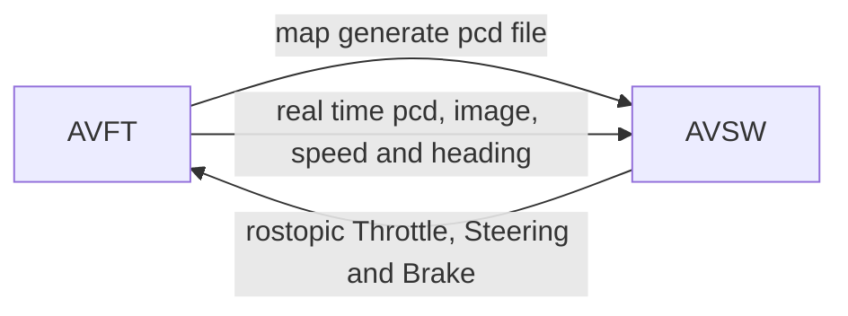

### Autonomous Vehicle Fidelity Testing



```bash
# env
carla 0.9.13

# configure
map: ntucetran.xodr
```

```bash
git clone git@github.com:xuehuan-yang/AVFT.git
# view ubuntu
Files -> ~/doc/AVFT.html -> Right Click Mouse-> Open With FireFox Web Browser
# voew windows
File Exploter -> ~/doc/AVFT.html -> Right Click Mouse -> Open with Goolge Chrome
```