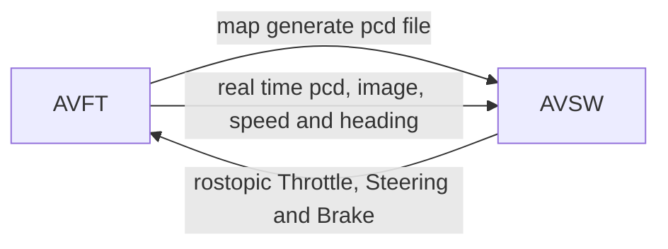

### Autonomous Vehicle Fidelity Testing

```bash
Research shows that the autonomous vehicles have to driven billions of miles to demonstrate liabilty. 

Testing autonomous driving algorithms on real vehicles is extremely costly.

Many researches and developers perform fidelity testing with correspoinding sensors and maps.
```

```bash
# env
carla 0.9.13
```

### sequence diagram


```bash
# configure
map: ntucetran.xodr
map: ntufull.xodr
```

```bash
git clone git@github.com:xuehuan-yang/AVFT.git
# view ubuntu
Files -> ~/doc/AVFT.html -> Right Click Mouse-> Open With FireFox Web Browser
# voew windows
File Exploter -> ~/doc/AVFT.html -> Right Click Mouse -> Open with Goolge Chrome
```